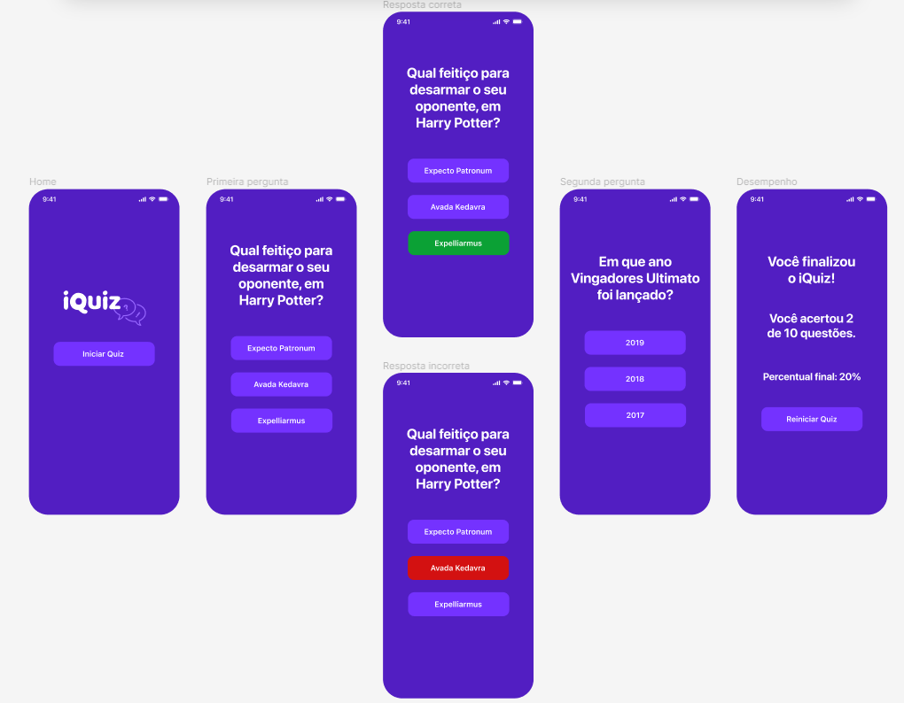

# [3) iOS - Construindo seu primeiro app](https://cursos.alura.com.br/course/ios-construindo-primeiro-aplicativo)

Aula 1 - Iniciando projeto

Aula 2 - Constraints, ações e navegação

Aula 3 - Tela de questão

Aula 4 - Modelagem dos dados

Aula 5 - Contruindo a tela desempenho

# [Prévia do projeto - figma](https://www.figma.com/file/arNzZp0KyM55CKpvlZjUOL/iQuiz?node-id=0%3A1)

