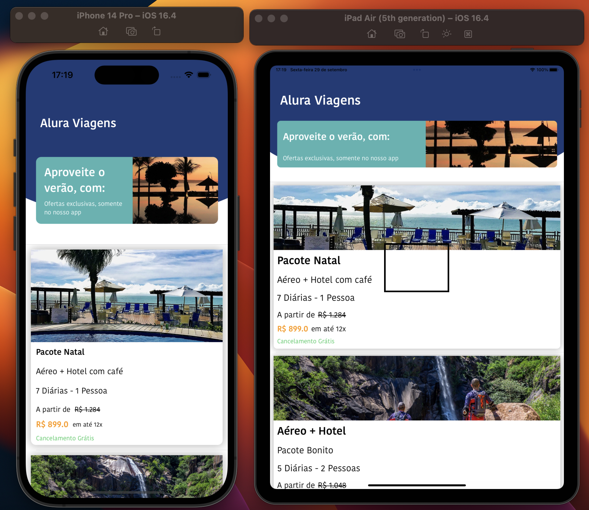

# [4) iOS - auto layout com Constraints](https://cursos.alura.com.br/course/ios-auto-layout-constraints)

Aula 1 - Iniciando projeto

Aula 2 - Cabeçalho do aplicativo - 1

Aula 3 - Cabeçalho do aplicativo - 2

Aula 4 - Editando e apagando constraints

Aula 5 - Criando células customizadas

Aula 6 - Tamanho de classes (size classes)

## Observações

Na aula 5 foi adicionado alguns arquivos mocks dado através do curso. O JSON é então consumido para exibir os dados no app

# Prévia do projeto

