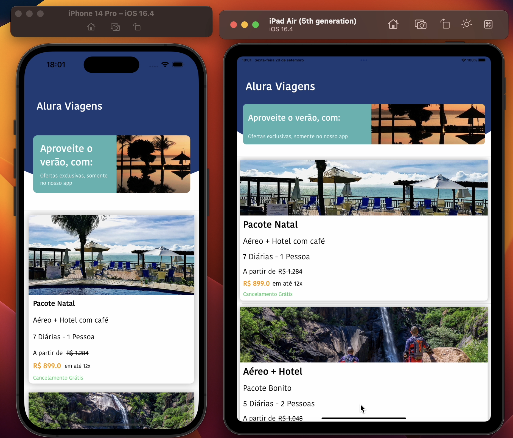
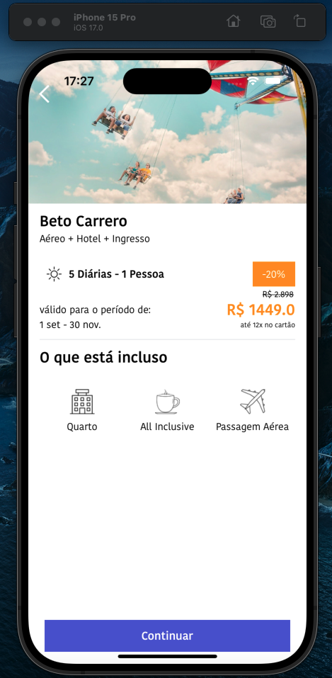

# [5) iOS - layout - mais recursos para criar telas responsivas](https://cursos.alura.com.br/course/ios-layout-parte-2-recursos-telas-responsivas)

Aula 1 - Criando ViewModel

Aula 2 - Utilizando UIStackView

Aula 3 - Criando uma nova tela

Aula 4 - Criando View Detalhes

Aula 5 - Navegação entre telas

## Observações

Esse curso é uma continuação do curso "iOS - auto layout com Constraints"

Tecnologias utilizadas:

- Protocolos MVVM, Delegate

- Interface com XIB e Storyboard

# Prévia do projeto

