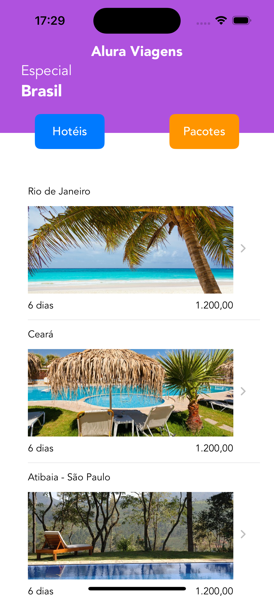

# [6) iOS - layouts com SwiftUI](https://cursos.alura.com.br/course/swift-ui)

Aula 1 - De UIKit para SwiftUI

Aula 2 - Elementos de interface em SwiftUI

Aula 3 - Criando novas views

Aula 4 - Testando em outros dispositivos

Aula 5 - Utilizando UIKit em SwiftUI (View do mapa com a localização da célula)

## Observações

Na prévia abaixo é possível ver o funcionamento do app, há a view principal e quando é clicado na célula abre um mapa com a localização.

Esse projeto também é responsivo com iPad, para isso foi utilizado size class

# Prévia do projeto
Iphone Principal

Iphone Celula

iPad Principal

iPad Celula

