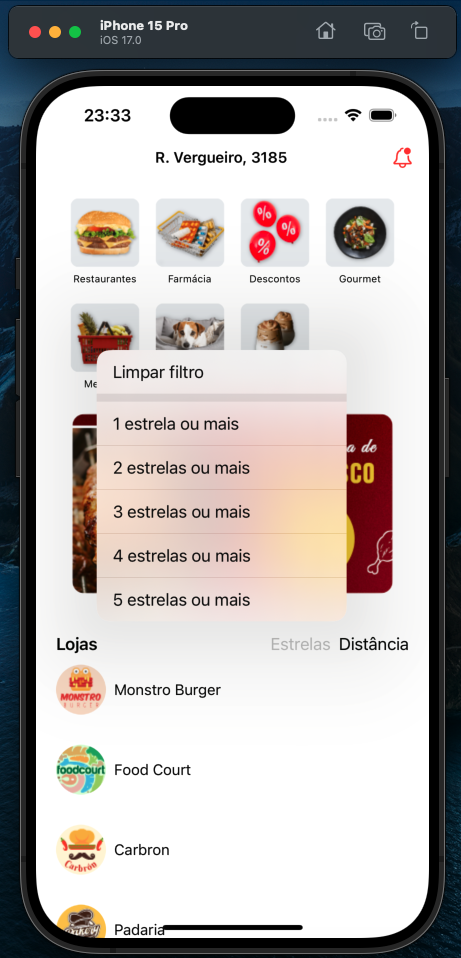
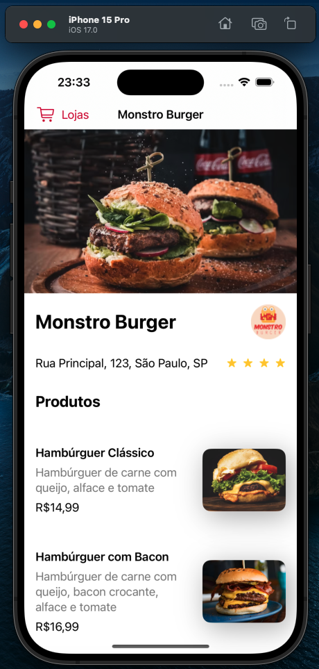

# [iOS com SwiftUI: construindo componentes e layouts - App ChefDelivery](https://cursos.alura.com.br/course/ios-swiftui-construindo-componentes-layouts)

Aula 1 - Navegação entre telas

Aula 2 - Construindo tela de restaurante

Aula 3 - Construindo tela de detalhes do produto

Aula 4 - Implementando filtros

Aula 5 - Extraindo Views (Refatorando projeto)

## Observações

Na prévia abaixo é possível ver o funcionamento do app

# Prévia do projeto

