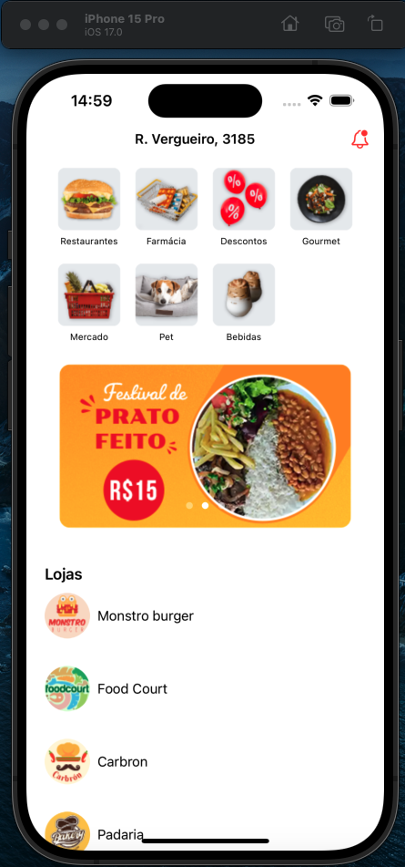

# [iOS com SwiftUI: construindo componentes e layouts - App ChefDelivery](https://cursos.alura.com.br/course/ios-swiftui-construindo-componentes-layouts)

Aula 1 - Conhecendo o app e SwiftUI

Aula 2 - Criando barra superior

Aula 3 - Montando peças do Grid

Aula 4 - Juntando peças do Grid

Aula 5 - Criando carrossel de imagens

Aula 6 - criando a lista de lojas

## Observações

Na prévia abaixo é possível ver o funcionamento do app

# Prévia do projeto

