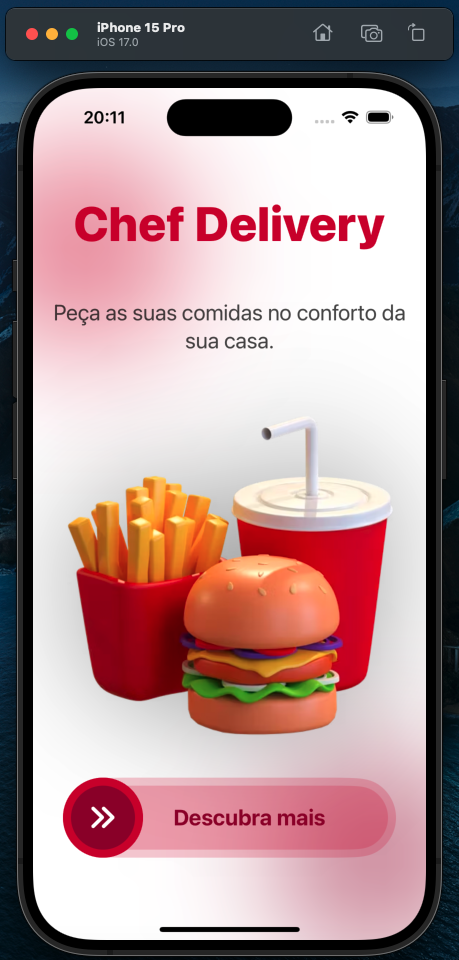
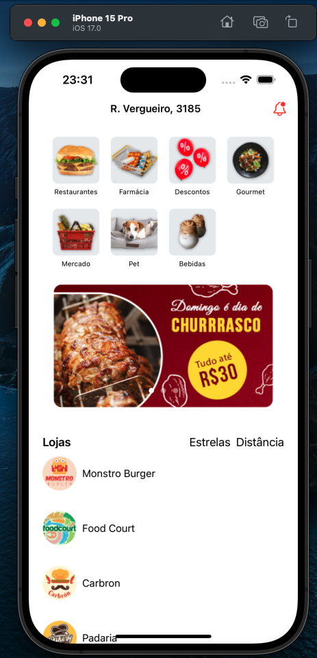
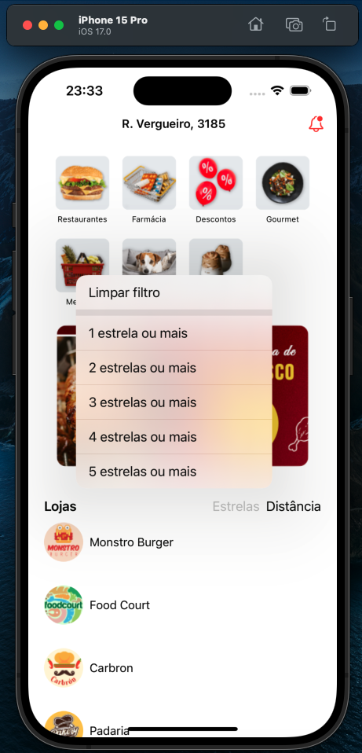
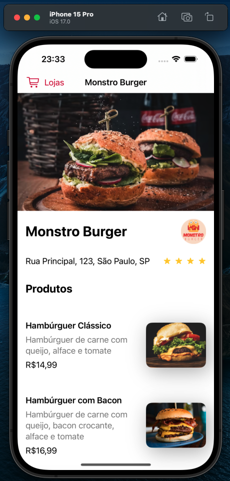
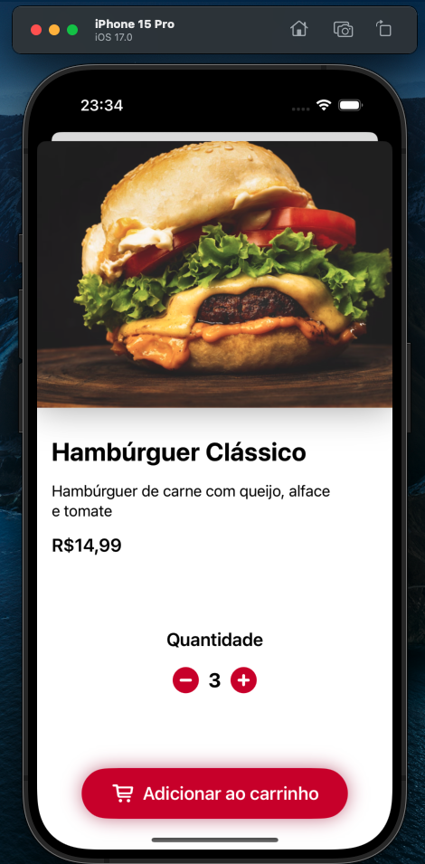

# [iOS com SwiftUI: trabalhando com animações e DragGesture](https://cursos.alura.com.br/course/ios-swiftui-trabalhando-animacoes-draggesture)

Aula 1 - Primeiros passos com animações

Aula 2 - Implementando DragGesture na imagem

Aula 3 - Construindo um botão customizado

Aula 4 - Aprimorando o carrossel de imagens

## Observações

Na prévia abaixo é possível ver o funcionamento do app

# Prévia do projeto

