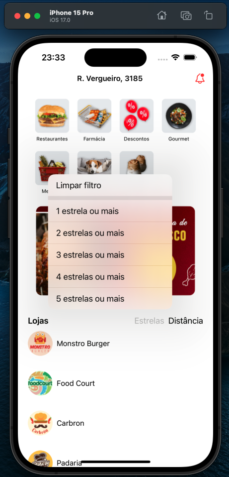

# [iOS com SwiftUI: fazendo requisições HTTP e conexão com API](https://cursos.alura.com.br/course/ios-swiftui-requisicoes-http-conexao-api)

Aula 1 - Requisição HTTP com Apiary

Aula 2 - 

Aula 3 - 

Aula 4 - 

Aula 5 - 

## Observações

Último curso que deixa de usar mocks e faz requisições ao servidor para receber os dados

Na prévia abaixo é possível ver o funcionamento do app

# Prévia do projeto

