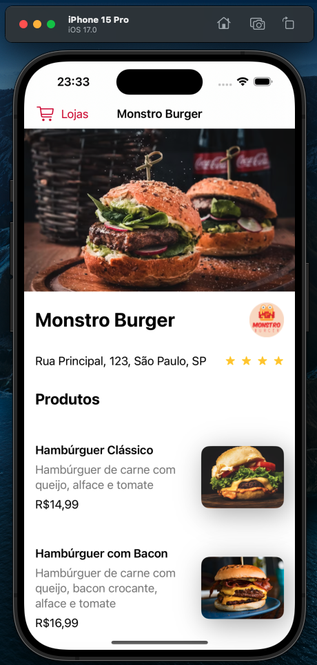

# [iOS com SwiftUI: fazendo requisições HTTP e conexão com API](https://cursos.alura.com.br/course/ios-swiftui-requisicoes-http-conexao-api)

Aula 1 - Requisição HTTP com Apiary

Aula 2 - Requisição com URLSession

Aula 3 - Métodos assíncronos

Aula 4 - Verbo POST

Aula 5 - Requisição com Alamofire

## Observações

Último curso que deixa de usar mocks e faz requisições ao servidor (utlizando Apiary) para receber os dados

Utilizou também uma biblioteca chamada Alamofire, ela foi instaalada no projeto e então importada para utilização, esta biblioteca deixa mais simples a forma com que as requests são enviadas.

Na prévia abaixo é possível ver o funcionamento do app

# Prévia do projeto

