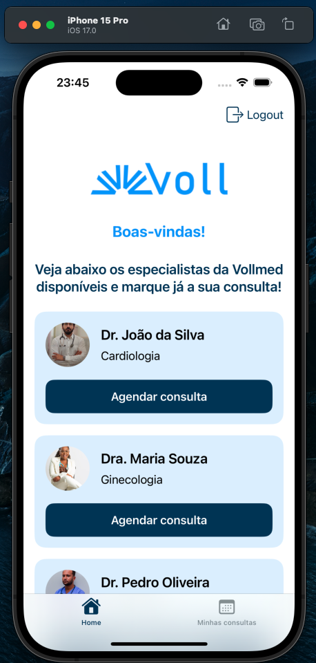
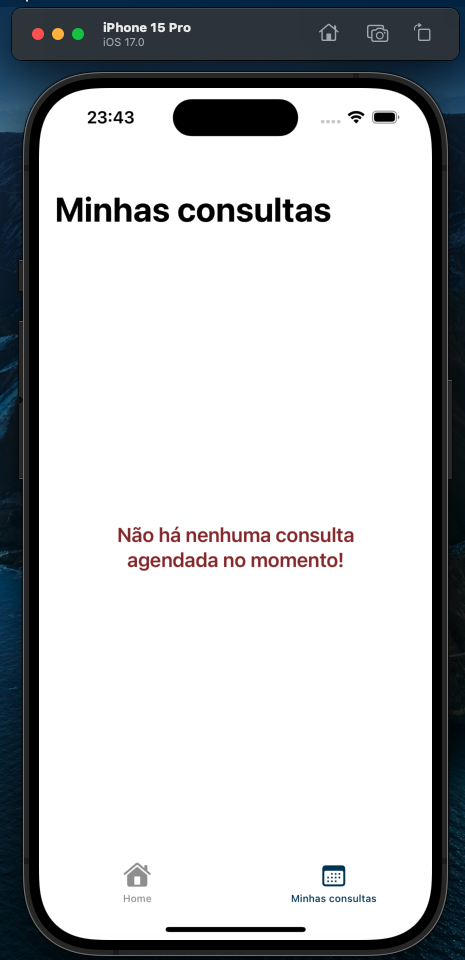
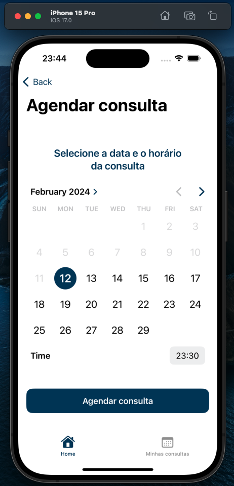
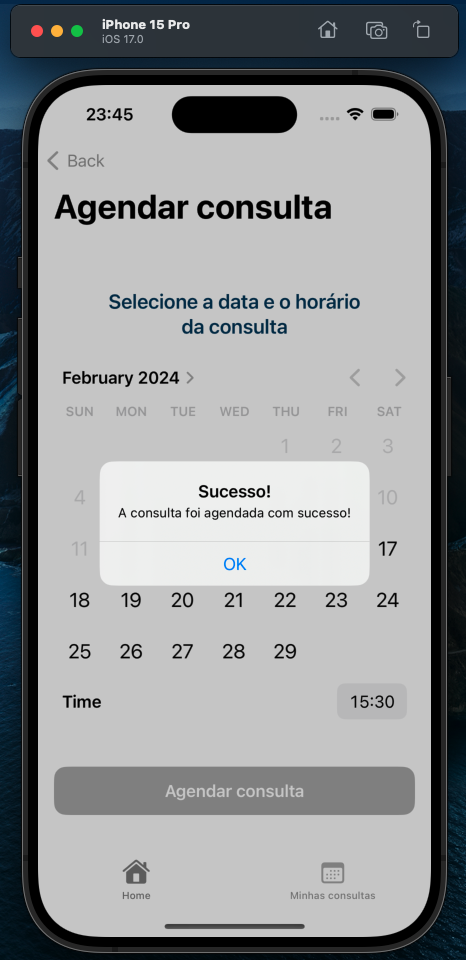
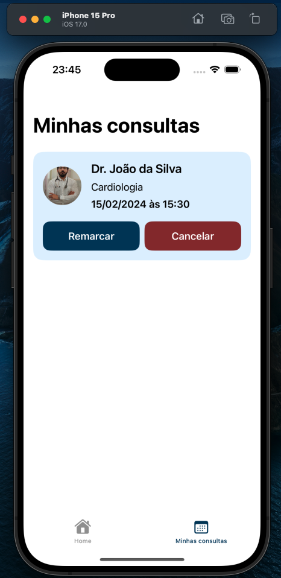
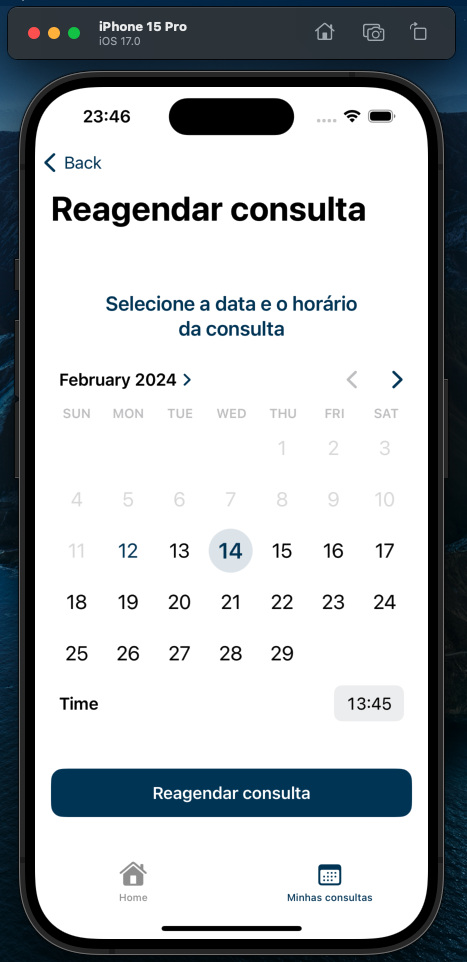
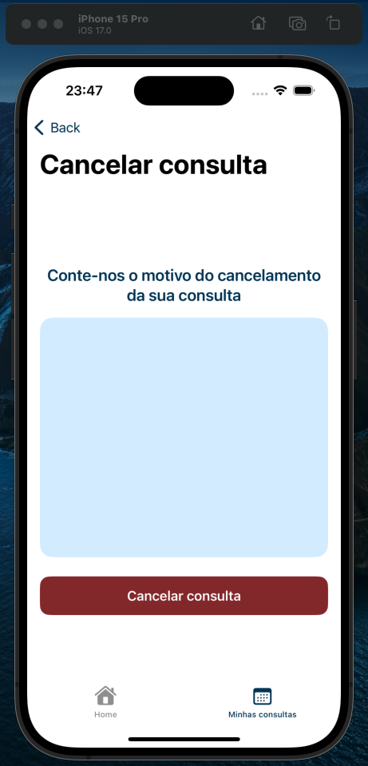

# [iOS com SwiftUI: construindo autenticação de usuários em uma aplicação](https://cursos.alura.com.br/course/ios-swiftui-autenticacao-usuarios-aplicacao)

Aula 1 - TextField e Picker

Aula 2 - Modelo de paciente

Aula 3 - Login e autenticação

Aula 4 - Token de autenticação

Aula 5 - Boas práticas de segurança

## Instalações

Baixar [Projeto Anterior](https://github.com/dev-luis-paulo/Estudos/tree/main/Formações%20Alura/3\)%20Evolua%20Apps%20em%20SwiftUI%20-%20CRUD%2C%20MVVM%20e%20Autenticação/1\)%20iOS%20com%20SwiftUI%20-%20aplicações%20com%20CRUD%20e%20APIs%20REST)

Baixar [NodeJS](https://nodejs.org/)

    1. npm install ts-node@latest --save-dev
    2. npm update
    
Baixar [API](https://github.com/alura-cursos/vollmed-api-swiftui/tree/authentication) e utilizar os seguintes comandos:

    1. Em package.json trocar a linha de start por: "start": "node -r ts-node/register ./src/server.ts",
    2. npm install (Para instalar os pacotes)
    3. npm start (Após passos anteriores feitos ir no caminho da api e executar somente esse comando)
    
Baixar [Insomnia](https://insomnia.rest/download/)

Importar o arquivo 'Vollmed-CRUD' no Insomnia (Isso deixará alguns exemplos de requisições para fazer a API)

## Informações do curso

Desenvolver sistema de autenticação seguro e integrado para aplicativos iOS utilizando SwiftUI e uma API restful

Criar telas intuitivas de registro e login com um design atrativo e requisição POST para registrar e autenticar usuários

Implementar e entender o componente Picker para seleção de opções em listas

Exibir feedbacks para o usuário por meio de alertas, proporcionando uma excelente experiência de usuário

Conhecer as melhores práticas para trabalhar com dados sensíveis como UserDefaults e Keychain, garantindo proteção e segurança

Manter e gerenciar informações de autenticação de maneira segura e centralizada utilizando o AuthenticationManager e o padrão Singleton

Usar o padrão @ObservedObject e @Published para atualizar dinamicamente partes da tela conforme as alterações no estado da autenticação

## Observações

O projeto inicial foi desenvolvido pela instrutora Giovanna Moeller da Alura, o intuito foi de aprender conceitos e práticas sobre autenticação de usuários na aplicação Vollmed, este curso é uma continuação do [Projeto Anterior](https://github.com/dev-luis-paulo/Estudos/tree/main/Formações%20Alura/3\)%20Evolua%20Apps%20em%20SwiftUI%20-%20CRUD%2C%20MVVM%20e%20Autenticação/1\)%20iOS%20com%20SwiftUI%20-%20aplicações%20com%20CRUD%20e%20APIs%20REST).

Abaixo é possível visualizar alguns imagens do projeto

# Prévia do projeto

